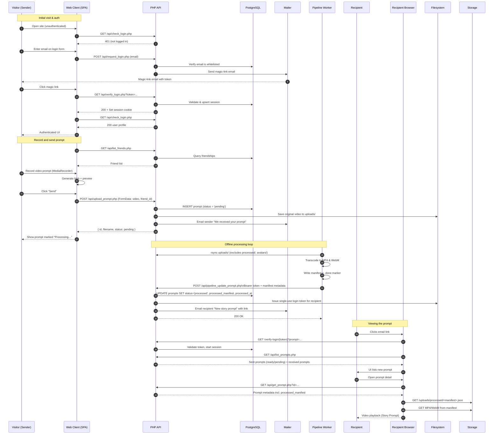

# Story Prompt End-to-End Flow

```mermaid
sequenceDiagram
    autonumber
    participant Visitor as Visitor (Sender)
    participant Browser as Web Client (SPA)
    participant API as PHP API
    participant DB as PostgreSQL
    participant Mail as Mailer
    participant Pipeline as Pipeline Worker
    participant Recipient as Recipient
    participant RecBrowser as Recipient Browser

    Note over Visitor,Browser: Initial visit & auth
    Visitor->>Browser: Open site (unauthenticated)
    Browser->>API: GET /api/check_login.php
    API-->>Browser: 401 (not logged in)
    Visitor->>Browser: Enter email on login form
    Browser->>API: POST /api/request_login.php (email)
    API->>DB: Verify email is whitelisted
    API->>Mail: Send magic-link email
    Mail-->>Visitor: Magic-link email with token
    Visitor->>Browser: Click magic link
    Browser->>API: GET /api/verify_login.php?token=...
    API->>DB: Validate & upsert session
    API-->>Browser: 200 + Set session cookie
    Browser->>API: GET /api/check_login.php
    API-->>Browser: 200 user profile
    Browser-->>Visitor: Authenticated UI

    Note over Visitor,Browser: Record and send prompt
    Browser->>API: GET /api/list_friends.php
    API->>DB: Query friendships
    API-->>Browser: Friend list
    Visitor->>Browser: Record video prompt (MediaRecorder)
    Browser->>Browser: Generate blob + preview
    Visitor->>Browser: Click “Send”
    Browser->>API: POST /api/upload_prompt.php (FormData: video, friend_id)
    API->>DB: INSERT prompt (status = 'pending')
    API->>Filesystem: Save original video to uploads/
    API->>Mail: Email sender “We received your prompt”
    API-->>Browser: { id, filename, status: pending }
    Browser-->>Visitor: Show prompt marked “Processing…”

    Note over Pipeline,API: Offline processing loop
    Pipeline->>API: rsync uploads/ (excludes processed/, avatars/)
    Pipeline->>Pipeline: Transcode to MP4 & WebM
    Pipeline->>Pipeline: Write manifest + .done marker
    Pipeline->>API: POST /api/pipeline_update_prompt.php\nBearer token + manifest metadata
    API->>DB: UPDATE prompts SET status='processed', processed_manifest, processed_at
    API->>Filesystem: Issue single-use login token for recipient
    API->>Mail: Email recipient “New story prompt” with link
    API-->>Pipeline: 200 OK

    Note over Recipient,RecBrowser: Viewing the prompt
    Recipient->>RecBrowser: Clicks email link
    RecBrowser->>API: GET /verify-login/{token}?prompt=...
    API->>DB: Validate token, start session
    RecBrowser->>API: GET /api/list_prompts.php
    API-->>RecBrowser: Sent prompts (ready/pending) + received prompts
    RecBrowser->>Recipient: UI lists new prompt
    Recipient->>RecBrowser: Open prompt detail
    RecBrowser->>API: GET /api/get_prompt.php?id=...
    API-->>RecBrowser: Prompt metadata incl. processed_manifest
    RecBrowser->>Storage: GET /uploads/processed/<manifest>.json
    RecBrowser->>Storage: GET MP4/WebM from manifest
    RecBrowser-->>Recipient: Video playback (Story Prompt)
```
